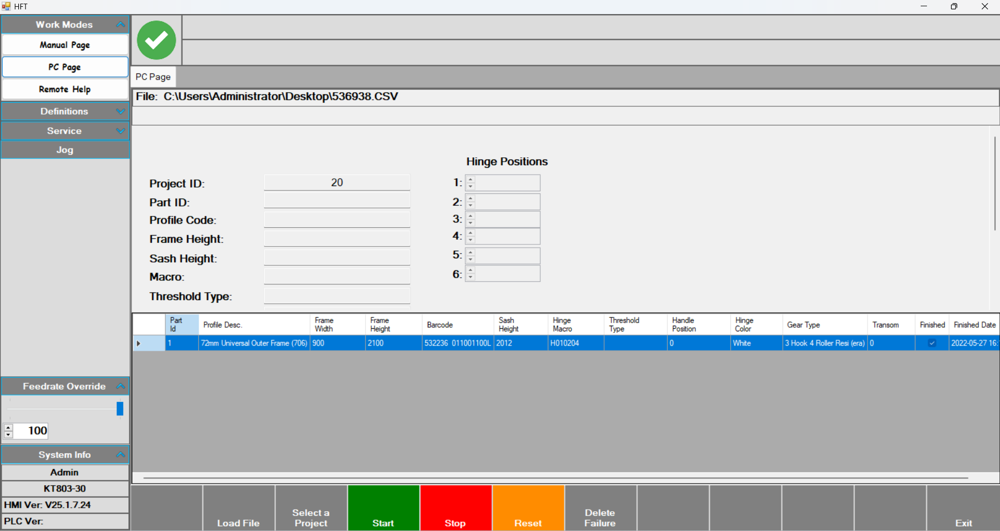
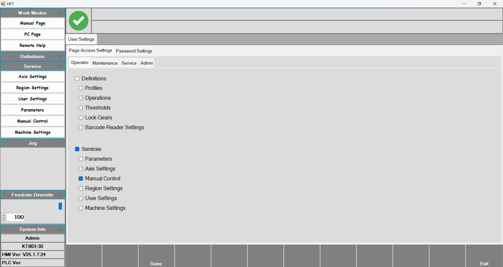
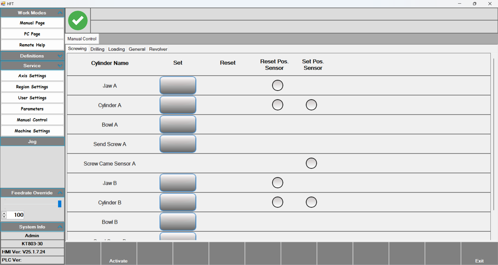
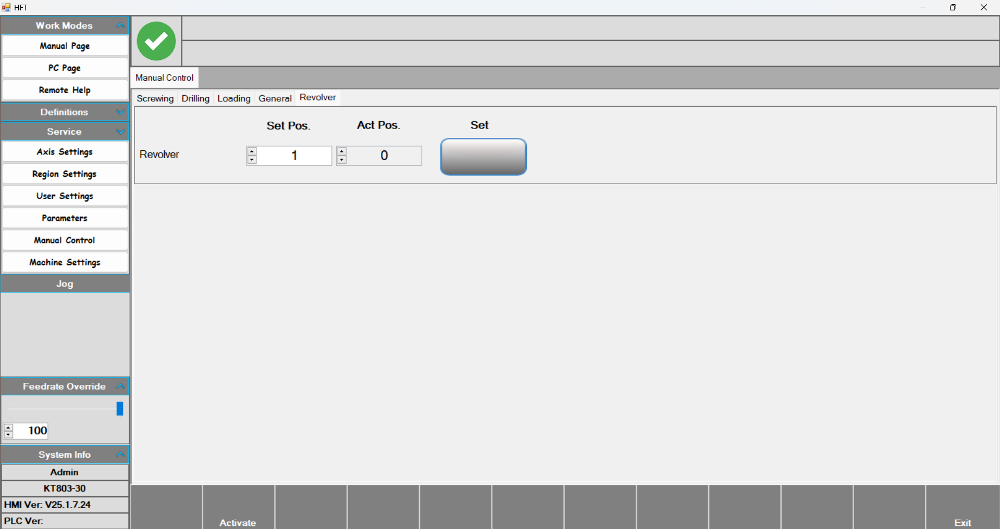
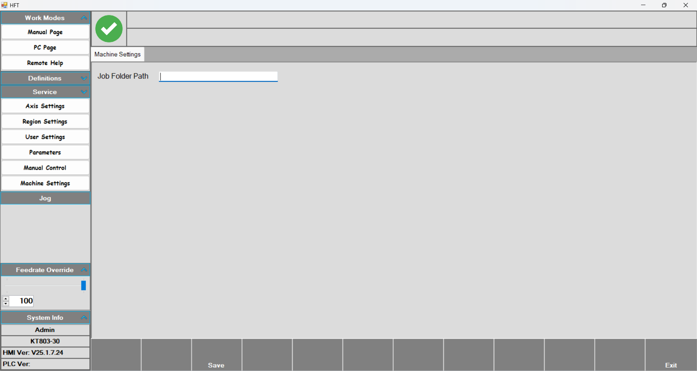

# KT803_30-34387 Manual

Frame machine for mounting hinges on profiles with two motors, two screw-driving units, a revolver, and an X-axis

## Manual Work Page

**Manual Work Page:** The page where jobs are run manually. By selecting the profile and hinge, you can perform operations at the desired position.

- First, select **Thresholds** and **Profiles**.
- Next, select a defined hinge under **Hinge Code**.
- Enter the desired position in **Hinge Positions**.
- Choose right- or left-opening under **Right Opening**.

•	After all these parameters are entered, press Start and then press the foot pedal to begin. On the first press, the front pre-clamp that the profile rests against engages; on the second press, the centering clamps engage. On the third press, three front clamps that hold the profile engage, and the drilling motor moves to the position specified in Hinge Positions. When drilling is complete, the motor group waits on the right. The operator then places the hinge and presses the foot pedal again to perform screw-driving. After screw-driving, the motor group moves to the ground position and the operation is completed.

## Pc Page

**PC Page:** Operator’s workspace.

- After starting, scan the barcode. Once scanned, the parameters for the job populate the fields. The table at the bottom lists the scanned jobs.
- Use **Feedrate Override** on the left to reduce the process speed.

## Remote Help

**Remote Help:** Establish a remote connection to receive support from authorized personnel.

## Profiles

**Profiles:** Page where profiles to be processed are defined.

- **Profile Code:** Enter the name assigned to the profile.
- **Hinge Drill Revolver:** Revolver level at which the tool group will perform the operation.
- **Espagnolet Screw No:** Not applicable; KT-803 frame machines do not have espagnolets.

## Operations

**Operations:** Hinge definitions to be used are created here.

- Use **Hinge code** to name the hinge. With **Select macro**, choose left or right opening. Use **Save macro** to save the defined macro, and **Delete macro** to remove it.
- **Head and End Pos:**
- **Macro 	X offset:** ?
- **Select Operation:** Choose the desired operation here. Four options are available: Hinge Drilling (left motor), Long Screw Drilling (right motor), Long Screw (left screw-driving), and Short Screw (right screw-driving).
- **Operation X offset** determines the drilling and screw-driving positions. Measurements are taken on the hinge; the first drilling is treated as 0, and caliper measurements from the hinge are entered relative to this zero.
- **Operation Y offset** sets the revolver level to be used.

## Thresholds

## Barcode Reader Settings

## Axis Settings

**AXIS SETTINGS:** The SDX1 axis is calibrated using the parameters on this page.

- In the calibration table, enter the **Calibration position** to calibrate the axis. The current position is shown as **Actual position**.
- **Minimum Limit position:** Minimum position the axis can reach.
- **Minimum Limit Enabled:** Enables the minimum travel limit.
- **Maximum Limit position:** Maximum position the axis can reach.
- **Maximum Limit Enabled:** Enables the maximum travel limit.
- **Ground position:** The position where the tool group waits before starting and after finishing the operation.
- **Maximum Velocity:** Maximum speed the axis can reach.
- **Move Velocity:** Minimum speed the axis can move at.

## Region and Language

**Region and Language:** After selecting the desired language and unit, click Save to apply the changes.

## User Settings

## Manual Control

**Manual Control:** After clicking Activate, press the desired output to toggle it on. Press again to return it to its previous state.

## Parameters

- **Parameters:** This page contains offset values for the motors and screw-driving groups in the tool group.
- **Left Drill Offset:** The first motor of the tool group. Since it is on the far left, this motor is taken as zero.
- **Left-Right Drill Distance:** Distance between the two motors.
- **Left-Head Screw - Left Drill Distance:** Distance between the first motor and the first screw-driving group.
- **Right Head Screw - Left Drill Distance:** Distance between the first motor and the second screw-driving group.

## Revolver

- This is the section where the revolver level is set on the Manual Control page. Enter the desired value in the Set Pos parameter and click Set. The revolver then moves to the requested level. The current revolver level is shown as Act.Pos.

## Machine Settings

